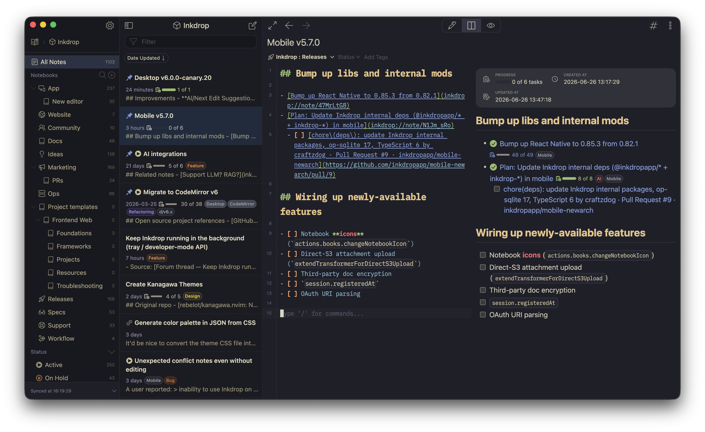

# Kanagawa Wave theme for Inkdrop

Kanagawa Wave theme for [Inkdrop](https://www.inkdrop.app/).
The color palette is based on [rebelot/kanagawa.nvim](https://github.com/rebelot/kanagawa.nvim) — a dark colorscheme inspired by the colors of the famous painting by Katsushika Hokusai.



## Installation

```sh
ipm install kanagawa-wave
```
